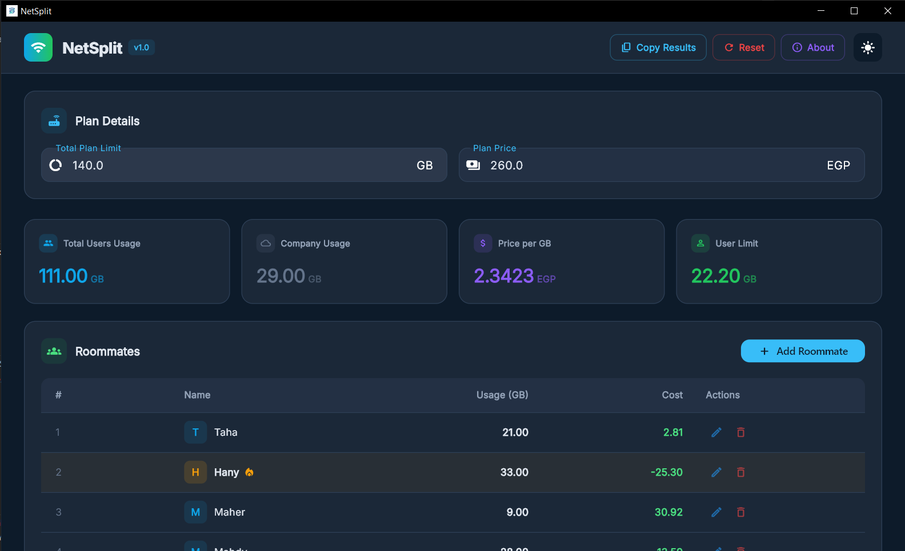
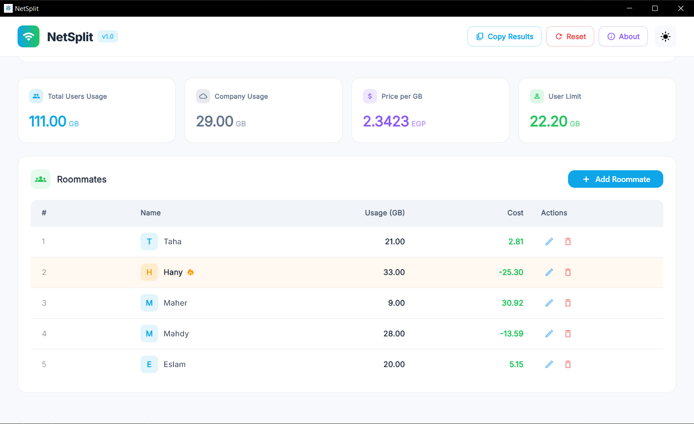
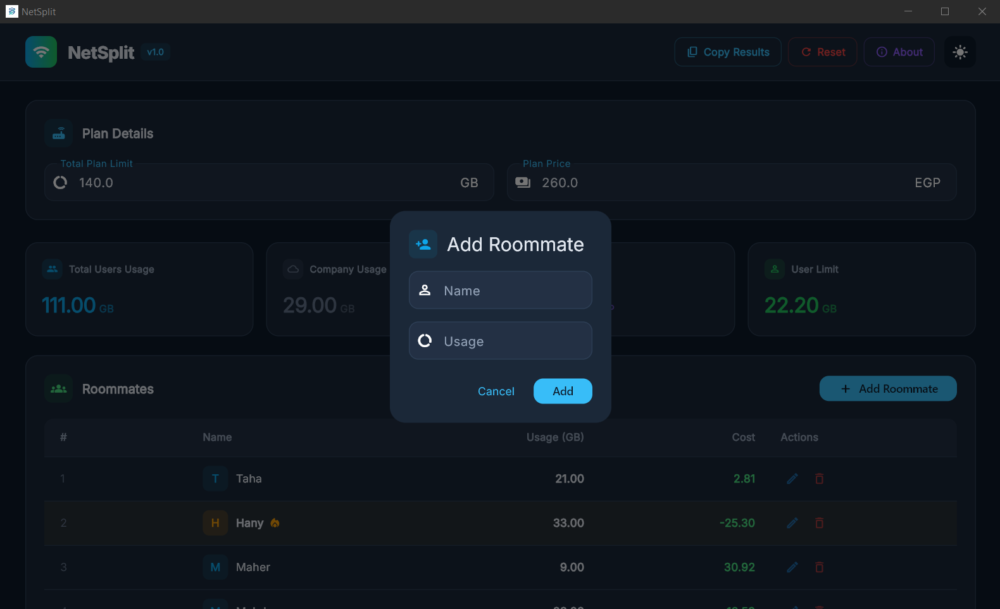
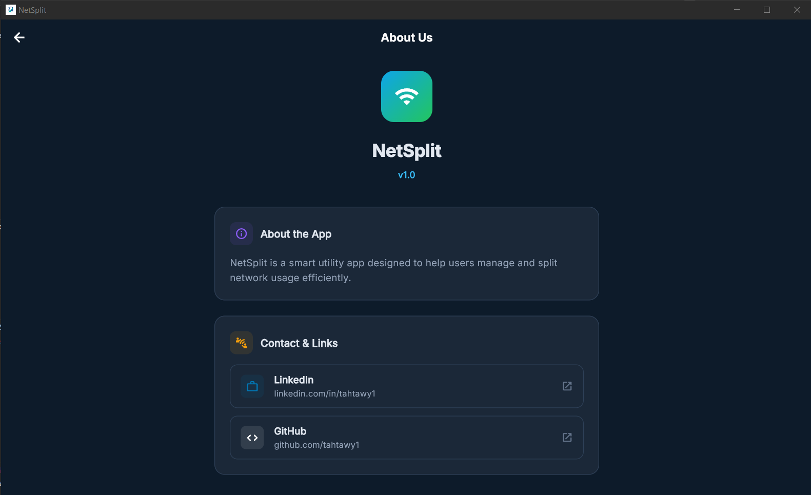
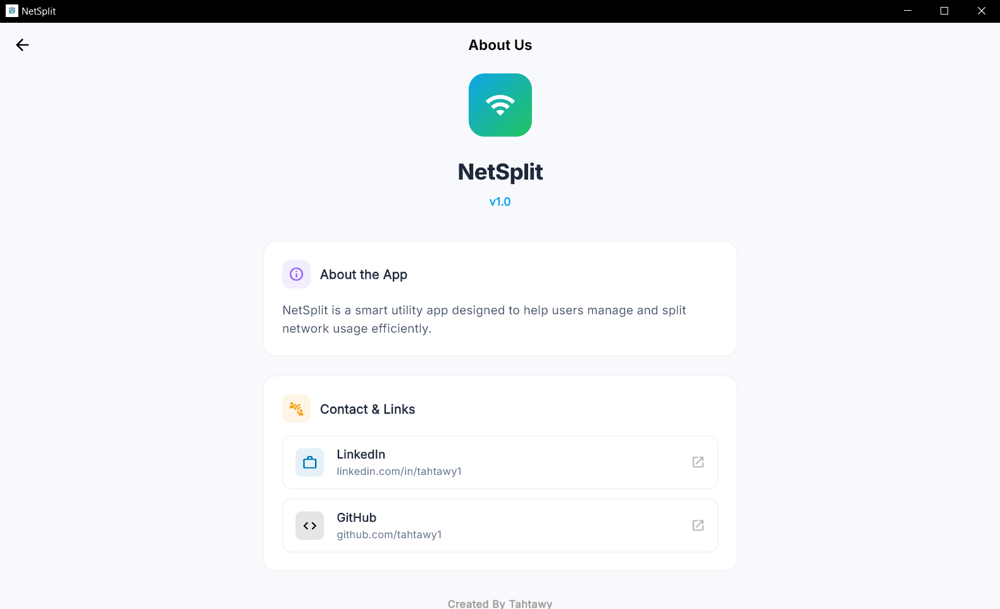

🖥️ Project Overview

NetSplit Desktop App is a Flutter-based desktop application designed to calculate, manage, and analyze network usage in a structured and efficient way.

The project focuses on providing a clean dashboard experience managing users, and visualizing consumption details. It follows a feature-first, clean architecture approach to ensure scalability and maintainability (manually).

🌟 Core Features
📊 Usage Monitoring Dashboard

Provides a structured UI to display network usage statistics per user and per plan (manually).
Includes breakdowns for total usage, individual consumption, and remaining balance.

👥 User Management System

Allows handling multiple users under a single network plan with assigned usage and limits.

📈 Consumption Logic (Tracking System – In Progress)
Designed to calculate usage dynamically per user
Supports aggregation of total consumption per plan
Remaining balance logic is prepared but not fully implemented yet

⚠️ Real-time tracking system is currently under development.

🎨 Clean Desktop UI
Desktop-optimized layout
Responsive dashboard design
Organized navigation for admin-style usage
🛠️ Tech Stack & Tools
Framework: Flutter (Desktop Support)
Local Storage (Optional): Hive
Architecture: MVVM + Clean Architecture
📂 Project Structure

The project follows a feature-driven clean architecture:

/core
  /constants
  /theme
  /router
  /services
  /utils
  /validators
  /error

/feature
  /dashboard
  /users
  /auth
  /splash
  
🧠 Architecture Notes:
Separation between UI, Logic, and Data layers
Each feature is self-contained (models, cubits, views, widgets)
Scalable structure suitable for large desktop systems
📊 Project Status
✅ Desktop UI structure completed
✅ Navigation system implemented

---

## 📸 Screenshots

  
  
  

  
  

